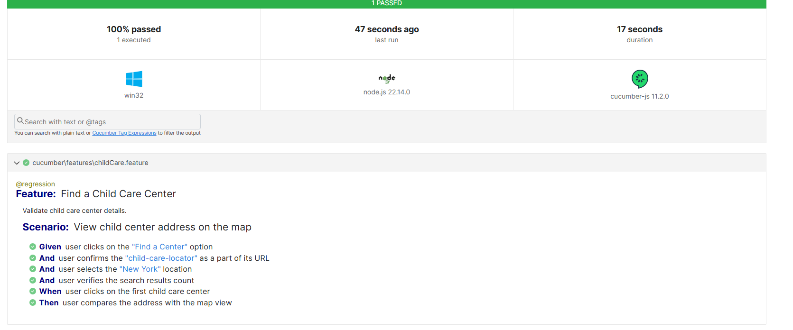

**brighthorizons** Client **Playwright + Cucumber + POM + TypeScript** project using **Yarn**:

---

### **Step 1: Initialize the Project**

Run the following commands in your terminal:

```sh
mkdir brighthorizons-client
cd brighthorizons-client
yarn init -y
```

---

### **Step 2: Install Dependencies**

Install **Playwright, Cucumber, TypeScript, and required plugins**:

```sh
yarn add -D @playwright/test playwright cucumber @cucumber/cucumber ts-node typescript @types/node
```

---

### **Step 3: Setup TypeScript Configuration**

Create a **`tsconfig.json`** file:

```json
{
  "compilerOptions": {
    "target": "ES6",
    "module": "CommonJS",
    "strict": true,
    "noImplicitAny": false,
    "outDir": "dist"
  }
}
```

---

### **Step 4: Configure Cucumber**

Create a **`cucumber.js`** file for Cucumber configuration:

```js
module.exports = {
  default: {
    require: [
      "cucumber/**/**/*.ts", // Include step definitions
    ],
    format: [
      "@cucumber/pretty-formatter",
      ["html", "output/cucumber-report.html"],
      ["junit", "output/cucumber-report.xml"],
      ["usage", "output/cucumber-steps.txt"],
      ["json", "output/cucumber-report.json"],
    ],
    requireModule: ["ts-node/register"],
  },
};
```

---

### **Step 5: Create Project Structure**

Create the following folder structure:

```
📂 brighthorizons-client
 ┣ 📂 cucumber
 ┃ ┣ 📂 features
 ┃ ┃ ┗ 📜 childCare.feature
 ┃ ┣ 📂 steps
 ┃ ┃ ┗ 📜 childCareStep.ts
 ┃ ┃  📂 pages
 ┃ ┃ ┗ 📜 childCarePage.ts
 ┃ ┣ 📂 hooks
 ┃ ┃ ┗ 📜 common.ts
 ┣ 📜 cucumber.js
 ┣ 📜 tsconfig.json
 ┣ 📜 package.json
```

---

### **Step 6: Write a Sample Feature File**

Create **`cucumber/features/example.feature`**:

```gherkin
@regression
Feature: Find a Child Care Center  
  Validate child care center details.

  Scenario: View child center address on the map  
    Given user clicks on the "Find a Center" option  
    And user confirms the "child-care-locator" as a part of its URL   
    And user selects the "New York" location  
    And user verifies the search results count  
    When user clicks on the first child care center  
    Then user compares the address with the map view  

```

---

### **Step 7: Implement Step Definitions**

Create **`cucumber/steps/exampleSteps.ts`**:

```ts
import { Given, Then, When } from "@cucumber/cucumber";
import { ChildCarePage } from "../pages/ChildCarePage";

Given("user clicks on the {string} option", async function (string) {
  const childCarePage = new ChildCarePage(this.page);

  await childCarePage.clickOnFindCenter();
});

Given(
  "user confirms the {string} as a part of its URL",
  async function (subUrl: string) {
    const childCarePage = new ChildCarePage(this.page);

    await childCarePage.confirmUrlContains(subUrl);
  },
);

Given("user selects the {string} location", async function (location: string) {
  const childCarePage = new ChildCarePage(this.page);

  await childCarePage.fillFindCenetr(location);
});

Given("user verifies the search results count", async function () {
  const childCarePage = new ChildCarePage(this.page);

  await childCarePage.confirmCenters();
});

When("user clicks on the first child care center", async function () {
  const childCarePage = new ChildCarePage(this.page);

  await childCarePage.clickChildCareCenter();
});

Then("user compares the address with the map view", async function () {
  const childCarePage = new ChildCarePage(this.page);

  await childCarePage.compareMapAddress();
});

```

---

### **Step 8: Run the Test**

Add the following script to your **`package.json`**:

```json
 "scripts": {
    "cucumber": "playwright install && cucumber-js"
  },
```

Run the test using:

```sh
yarn cucumber .\cucumber\features\Login.feature
```
### **Step 9: Results**
